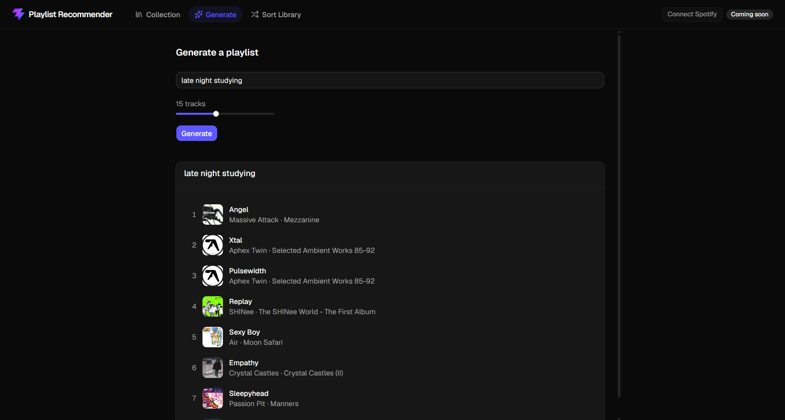

# Playlist Recommender

Generates a playlist from a natural language prompt, and auto-sorts a messy Spotify library into cohesive playlists by clustering track embeddings.

**Live:** https://playlist-recommender-three.vercel.app/. Click "Load sample collection" to try it instantly.

- Build a collection by searching Spotify
- Describe a vibe for a playlist and it'll generate one from the songs in your collection
- Or hand it an unsorted collection and it will cluster the tracks into playlists, drop the outliers, and name each one with an LLM

**Stack:** FastAPI, PostgreSQL + pgvector, sentence-transformers, scikit-learn, Claude API, React/Vite/Tailwind. Deployed on Fly.io, Supabase, and Vercel.
